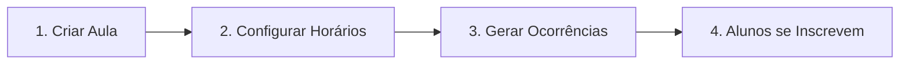

# ✅ FASE 10: Aulas (Turmas em Grupo) - CONCLUÍDA

**Data**: 18 de outubro de 2025  
**Status**: ✅ CONCLUÍDO

---

## 🎯 Objetivo

Implementar sistema completo de **Aulas em Grupo** com:
- Admin cria aulas (templates)
- Admin configura horários semanais recorrentes
- Admin gera ocorrências no calendário
- Alunos se inscrevem em ocorrências específicas

---

## 📚 CONCEITOS IMPORTANTES

### O que são Ocorrências?

**Aula → Horário Semanal → Ocorrência**

| Conceito | Descrição | Exemplo |
|----------|-----------|---------|
| **Aula** | Template da aula (configuração base) | "Beach Tennis Iniciante" - 60min, máx 8 alunos, R$80 |
| **Horário Semanal** | Configuração recorrente | Toda Terça-feira às 19:00 com Instrutor Carlos na Quadra 1 |
| **Ocorrência** | Aula real no calendário | 05/11/2025 às 19:00 (data específica) |

### Fluxo de Trabalho do Admin



**Exemplo Prático**:

1. **Admin cria aula**:
   - Nome: "Beach Tennis Iniciante"
   - Duração: 60 minutos
   - Capacidade: 8 alunos
   - Preço: R$ 80,00

2. **Admin configura horários semanais**:
   - Terça-feira às 19:00 (Instrutor Carlos, Quadra 1)
   - Quinta-feira às 19:00 (Instrutor Ana, Quadra 2)

3. **Admin gera ocorrências** (01/11 a 30/11):
   ```
   → 05/11/2025 19:00 (Terça) - Instrutor Carlos
   → 07/11/2025 19:00 (Quinta) - Instrutor Ana
   → 12/11/2025 19:00 (Terça) - Instrutor Carlos
   → 14/11/2025 19:00 (Quinta) - Instrutor Ana
   ... (total: 8 ocorrências criadas)
   ```

4. **Aluno João se inscreve**:
   - Escolhe ocorrência do dia 12/11/2025 19:00
   - Sistema valida capacidade (8 vagas)
   - Inscrição confirmada

---

## ✅ Implementado

### Backend (100% Completo)

#### 1. Models (4 arquivos)

**`app/Models/Aula.php`**
```php
// Template da aula
fillable: nome, esporte, nivel, duracao_min, capacidade_max, preco_unitario, descricao, requisitos, status
relationships: hasMany(horarios), hasMany(ocorrencias), hasMany(inscricoes)
```

**`app/Models/HorarioAula.php`**
```php
// Configuração semanal recorrente
fillable: id_aula, id_instrutor, id_quadra, dia_semana (1-7), hora_inicio
relationships: belongsTo(aula), belongsTo(instrutor), belongsTo(quadra)
```

**`app/Models/OcorrenciaAula.php`**
```php
// Aula real no calendário
fillable: id_aula, id_instrutor, id_quadra, inicio, fim, status
relationships: belongsTo(aula), belongsTo(instrutor), belongsTo(quadra), hasMany(inscricoes)
attributes: numero_inscritos, is_cheia
```

**`app/Models/InscricaoAula.php`**
```php
// Inscrição do aluno em uma ocorrência
fillable: id_ocorrencia_aula, id_aula, id_usuario, status
relationships: belongsTo(ocorrencia), belongsTo(aula), belongsTo(usuario)
```

#### 2. Controllers (4 arquivos)

**`AulaController`** - CRUD de aulas
- `index()` - Listar com filtros (status, esporte, nivel, search), eager loading de counts
- `store()` - Criar aula (validação: duracao_min 15-240, capacidade_max 1-50)
- `show()` - Detalhes da aula com horários
- `update()` - Atualizar aula
- `destroy()` - Soft delete (status='inativa')

**`HorarioAulaController`** - CRUD de horários semanais
- `index()` - Listar horários de uma aula
- `store()` - Criar horário semanal (validação anti-duplicação)
- `update()` - Atualizar horário
- `destroy()` - Remover horário

**`OcorrenciaAulaController`** - Geração e listagem de ocorrências
- `index()` - Listar ocorrências (filtros: id_aula, id_instrutor, data_inicio, data_fim, apenas_futuras)
- `show()` - Detalhes da ocorrência com inscrições
- `gerar()` - **Gera ocorrências automaticamente** baseado em horários semanais
- `cancelar()` - Cancelar ocorrências futuras de uma aula

**`InscricaoAulaController`** - Inscrições de alunos
- `minhasInscricoes()` - Listar inscrições do aluno logado
- `inscrever()` - Inscrever em ocorrência (valida capacidade)
- `cancelar()` - Cancelar inscrição
- `index()` - Listar todas inscrições (admin)

#### 3. Service Layer

**`app/Services/OcorrenciaAulaService.php`** (160 linhas)

Responsável pela **geração automática de ocorrências** com lógica complexa:

```php
public function gerarOcorrencias(int $idAula, Carbon $dataInicio, Carbon $dataFim): array
{
    // 1. Busca horários semanais da aula
    // 2. Para cada horário:
    //    - Calcula datas baseado no dia da semana (ISO 8601)
    //    - Gera ocorrências no período
    //    - Valida anti-overlap (instrutor e quadra)
    //    - Cria ocorrências válidas
    // 3. Retorna: ['criadas' => X, 'puladas' => Y, 'ocorrencias' => [...]]
}

private function gerarOcorrenciasParaHorario(...)
{
    // Usa Carbon::dayOfWeekIso para calcular próximas datas
    // Exemplo: Horário = Terça (2), Início = 01/11 (Sexta)
    //   → Próxima terça: 05/11
    //   → Loop: 05/11, 12/11, 19/11, 26/11
}

private function temConflito(...)
{
    // Verifica overlaps com:
    // - Outras ocorrências do mesmo instrutor
    // - Outras ocorrências na mesma quadra
    // Query: WHERE (inicio < fim AND fim > inicio)
}
```

**Anti-Overlap Logic**:
- Valida conflito de **instrutor** (não pode estar em 2 lugares)
- Valida conflito de **quadra** (não pode ter 2 aulas simultâneas)
- Pula ocorrências conflitantes (conta em "puladas")

#### 4. Seeder

**`database/seeders/AulaSeeder.php`** ✅ **Executado**

```php
// 4 aulas criadas:
1. Beach Tennis Iniciante (60min, 8 vagas, R$80)
   - Seg/Qua 18:00 (Carlos Silva)
   
2. Beach Tennis Intermediário (90min, 6 vagas, R$120)
   - Ter/Qui 19:30 (Carlos Silva)
   
3. Beach Tennis Kids (45min, 10 vagas, R$60)
   - Sábado 10:00 (Ana Paula Santos)
   
4. Funcional Express (30min, 15 vagas, Incluso)
   - Seg-Sex 07:00 (Ana Paula Santos)

Total: 14 horários semanais criados
```

#### 5. Rotas API

**Admin Routes** (`/api/admin/*`):
```php
// CRUD Aulas
GET    /admin/classes
POST   /admin/classes
GET    /admin/classes/{id}
PUT    /admin/classes/{id}
DELETE /admin/classes/{id}

// CRUD Horários Semanais
GET    /admin/class-schedules
POST   /admin/class-schedules
PUT    /admin/class-schedules/{id}
DELETE /admin/class-schedules/{id}

// Gerar/Cancelar Ocorrências
POST   /admin/class-occurrences/generate
POST   /admin/class-occurrences/{id}/cancel

// Listar Inscrições (admin)
GET    /admin/class-enrollments
```

**Public Routes** (`/api/*`):
```php
// Aluno visualiza aulas
GET /classes
GET /classes/{id}

// Aluno visualiza ocorrências
GET /classes/occurrences

// Aluno se inscreve
POST   /class-enrollments
DELETE /class-enrollments/{id}
```

---

### Frontend Admin (100% Completo)

#### 1. Types (`web/src/types/index.ts`)

```typescript
// 4 interfaces principais + 4 FormData types
Aula
HorarioAula
OcorrenciaAula
InscricaoAula

AulaFormData
HorarioAulaFormData
GerarOcorrenciasRequest
InscricaoAulaRequest
```

#### 2. Services (`web/src/services/classes.service.ts`)

**4 service classes, 33 methods total**:

```typescript
ClassesService:
- list(filters?) → Lista aulas com filtros
- get(id) → Detalhes da aula
- create(data) → Criar aula
- update(id, data) → Atualizar aula
- delete(id) → Soft delete

ClassSchedulesService:
- list(filters?) → Listar horários
- create(data) → Criar horário semanal
- update(id, data) → Atualizar horário
- delete(id) → Remover horário

ClassOccurrencesService:
- list(filters?) → Listar ocorrências
- get(id) → Detalhes da ocorrência
- gerar(request) → Gerar ocorrências no calendário
- cancelar(id) → Cancelar ocorrências futuras

ClassEnrollmentsService:
- myEnrollments(filters?) → Minhas inscrições
- enroll(request) → Inscrever-se
- cancel(id) → Cancelar inscrição
- list(filters?) → Listar todas (admin)
```

**Normalization Pattern**:
```typescript
const normalizeAula = (aula: any): Aula => ({
  id_aula: String(aula.id_aula),
  preco_unitario: aula.preco_unitario ? Number(aula.preco_unitario) : undefined,
  // ... outros campos
});
```

#### 3. Páginas Admin

**`Classes.tsx`** (360 linhas) - Lista de aulas
- Stats cards: Total, Ativas, Horários Configurados, Esportes
- Filtros: Search (debounced), Status, Esporte, Nível
- Cards com detalhes da aula
- Ações por card:
  - **Horários** → `/admin/aulas/{id}/horarios`
  - **Gerar** → `/admin/aulas/{id}/gerar-ocorrencias`
  - **Editar** → `/admin/aulas/editar/{id}`
  - **Deletar** (soft delete com confirmação)

**`AddClass.tsx`** (240 linhas) - Criar aula
- Form com validação
- Campos: nome, esporte, nivel, duracao_min, capacidade_max, preco_unitario, descricao, requisitos
- Submit → `classesService.create()`
- Loading state + Toast feedback

**`EditClass.tsx`** (295 linhas) - Editar aula
- useEffect para carregar aula existente
- Pre-popula formulário
- Submit → `classesService.update(id, data)`
- Campo adicional: Status (ativa/inativa)

**`ClassSchedules.tsx`** (380 linhas) - Configurar horários semanais
- Layout 2 colunas (form + tabela)
- Form para adicionar horário:
  - Dia da semana (1-7 → Segunda-Domingo)
  - Hora início (time input)
  - Instrutor (Select com API)
  - Quadra (Select com API)
- Tabela de horários cadastrados
- Ações: Deletar horário (com confirmação)

**`GenerateOccurrences.tsx`** (305 linhas) - Gerar ocorrências
- Date range picker (data_inicio, data_fim)
- Alertas informativos:
  - Explicação do processo
  - Aviso se não há horários configurados
- Botão "Gerar Ocorrências"
- Resultado da geração:
  - Card verde: X ocorrências criadas
  - Card amarelo: Y conflitos detectados
  - Detalhes em texto

#### 4. Rotas Frontend (`web/src/App.tsx`)

```tsx
// Admin Routes
<Route path="/admin/aulas" element={<Classes />} />
<Route path="/admin/aulas/novo" element={<AddClass />} />
<Route path="/admin/aulas/editar/:id" element={<EditClass />} />
<Route path="/admin/aulas/:id/horarios" element={<ClassSchedules />} />
<Route path="/admin/aulas/:id/gerar-ocorrencias" element={<GenerateOccurrences />} />
```

---

## 🧪 Como Testar

### 1. Verificar Dados do Seeder

```powershell
# Ver aulas criadas
docker-compose exec db psql -U fitway_user -d fitway_db -c "SELECT id_aula, nome, duracao_min, capacidade_max FROM aulas;"

# Ver horários semanais
docker-compose exec db psql -U fitway_user -d fitway_db -c "SELECT * FROM horarios_aula;"
```

**Resultado Esperado**: 4 aulas + 14 horários

### 2. Testar CRUD de Aulas

1. Login como admin: http://localhost:5173/login
   - Email: `admin@fitway.com`
   - Senha: `admin123`

2. Navegar para Aulas: http://localhost:5173/admin/aulas

3. **Criar aula**:
   - Clicar "Nova Aula"
   - Preencher formulário
   - Salvar

4. **Editar aula**:
   - Clicar botão "Editar" (ícone lápis)
   - Modificar campos
   - Salvar

5. **Deletar aula**:
   - Clicar botão "Deletar" (ícone lixeira)
   - Confirmar → Status muda para 'inativa'

### 3. Testar Configuração de Horários

1. Na lista de aulas, clicar botão **"Horários"**
2. Adicionar horário semanal:
   - Dia: Segunda-feira
   - Hora: 18:00
   - Instrutor: Carlos Silva
   - Quadra: Quadra 1
3. Clicar "Adicionar Horário"
4. Repetir para outros dias
5. Verificar tabela de horários cadastrados

### 4. Testar Geração de Ocorrências

1. Na lista de aulas, clicar botão **"Gerar"** (azul)
2. Selecionar período:
   - Data início: 01/11/2025
   - Data fim: 30/11/2025
3. Clicar "Gerar Ocorrências"
4. Aguardar processamento
5. Ver resultado:
   - Quantas ocorrências foram criadas
   - Quantos conflitos foram detectados

**Exemplo de Resultado**:
```
✅ 12 Ocorrências Criadas
⚠️ 2 Conflitos Detectados

Ocorrências geradas com sucesso para o período selecionado.
```

### 5. Verificar Ocorrências no Banco

```powershell
docker-compose exec db psql -U fitway_user -d fitway_db -c "SELECT id_ocorrencia_aula, inicio, fim, status FROM ocorrencias_aula LIMIT 10;"
```

---

## 🐛 Bugs Corrigidos Durante Implementação

### 1. Rota `/api/courts` retornando 404
**Problema**: `courtsService.getCourts()` chamava `/courts` mas rota é `/admin/courts`

**Solução**:
```typescript
// web/src/services/courts.service.ts
async getCourts(): Promise<Court[]> {
  const response = await apiClient.get<{ data: Court[] }>('/admin/courts');
  return response.data;
}
```

### 2. SelectItem com value vazio
**Problema**: Shadcn/ui não aceita `<SelectItem value="">`, causava erro de validação

**Solução**: Usar `value="livre"` e converter para `undefined` no handler:
```tsx
<Select 
  value={formData.nivel || 'livre'} 
  onValueChange={(value) => setFormData({ 
    ...formData, 
    nivel: value === 'livre' ? undefined : value 
  })}
>
  <SelectItem value="livre">Livre</SelectItem>
  <SelectItem value="iniciante">Iniciante</SelectItem>
</Select>
```

### 3. Tipos de IDs inconsistentes
**Problema**: Backend retorna `id_aula` como `number`, frontend precisa `string` para Select

**Solução**: Normalization functions em todos os services:
```typescript
const normalizeAula = (aula: any): Aula => ({
  id_aula: String(aula.id_aula),
  // ...
});
```

---

## 📝 Lições Aprendidas

### 1. Geração de Ocorrências é Complexa
- Precisa calcular datas corretamente (Carbon `dayOfWeekIso`)
- Precisa validar anti-overlap (instrutor E quadra)
- Precisa ser transacional (rollback em caso de erro)
- Service layer é essencial para essa lógica

### 2. Shadcn/ui Select é Rigoroso
- Nunca use `value=""` em SelectItem
- Sempre use placeholder para opção vazia
- Converta `undefined` ↔ string especial ('livre', 'all')

### 3. Normalização é Crítica
- Backend retorna IDs como `number`
- Frontend Select precisa `string`
- Criar funções `normalize*()` em TODOS os services

### 4. UX da Geração de Ocorrências
- Mostrar alerta se não há horários configurados
- Exibir resultado detalhado (criadas vs puladas)
- Usar cards coloridos (verde/amarelo) para feedback visual

---

## 🎯 Próximos Passos (Opcional)

### Página do Aluno - Inscrever-se em Aulas

**`StudentClasses.tsx`** - Página do aluno para ver e se inscrever em aulas:

**Features**:
- Listar aulas ativas
- Filtrar por esporte/nível
- Ver próximas ocorrências de cada aula
- Botão "Inscrever-se" (valida capacidade)
- Ver minhas inscrições
- Cancelar inscrição

**Rota**: `/aluno/aulas`

**API Calls**:
- `classesService.list({ status: 'ativa' })`
- `classOccurrencesService.list({ apenas_futuras: true, id_aula })`
- `classEnrollmentsService.enroll({ id_ocorrencia_aula, id_aula })`
- `classEnrollmentsService.myEnrollments()`
- `classEnrollmentsService.cancel(id)`

---

## 📊 Estatísticas da Fase

| Métrica | Valor |
|---------|-------|
| **Backend** | |
| Models criados | 4 |
| Controllers criados | 4 |
| Services criados | 1 (160 linhas) |
| Seeders executados | 1 (4 aulas, 14 horários) |
| Rotas API registradas | 9 (admin) + 4 (public) |
| **Frontend** | |
| Páginas criadas | 5 |
| Services criados | 4 (33 methods) |
| Types adicionados | 8 interfaces |
| Linhas de código (frontend) | ~1.580 |
| **Tempo Estimado** | 4-5 dias |

---

## ✅ Checklist de Conclusão

- [x] Backend: 4 Models criados
- [x] Backend: 4 Controllers implementados
- [x] Backend: OcorrenciaAulaService com anti-overlap
- [x] Backend: AulaSeeder executado
- [x] Backend: Rotas registradas (verified)
- [x] Frontend: Types definidos
- [x] Frontend: 4 Services implementados
- [x] Frontend: Classes.tsx (lista)
- [x] Frontend: AddClass.tsx (criar)
- [x] Frontend: EditClass.tsx (editar)
- [x] Frontend: ClassSchedules.tsx (horários)
- [x] Frontend: GenerateOccurrences.tsx (gerar)
- [x] Frontend: Rotas adicionadas no App.tsx
- [x] Bugs corrigidos (courts 404, SelectItem vazio)
- [x] Testado no navegador
- [x] Documentação criada

---

**Fase 10 COMPLETA!** 🎉

**Próxima fase sugerida**: StudentClasses.tsx (página do aluno)

---

**Última Atualização**: 18 de outubro de 2025  
**Documentado por**: Fitway Development Team
